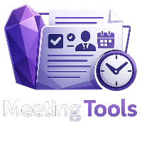
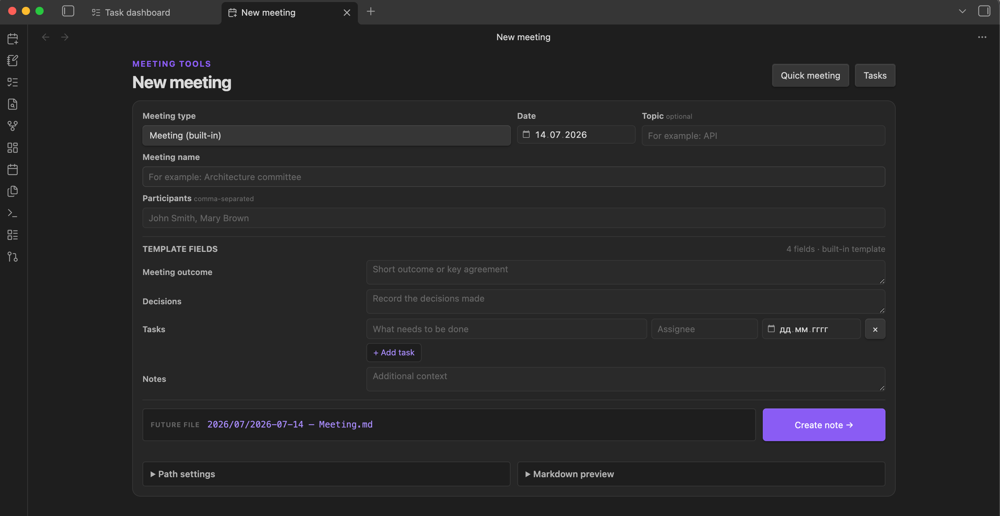
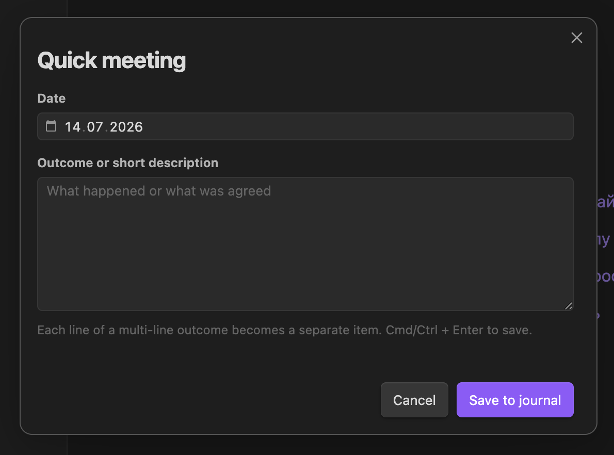
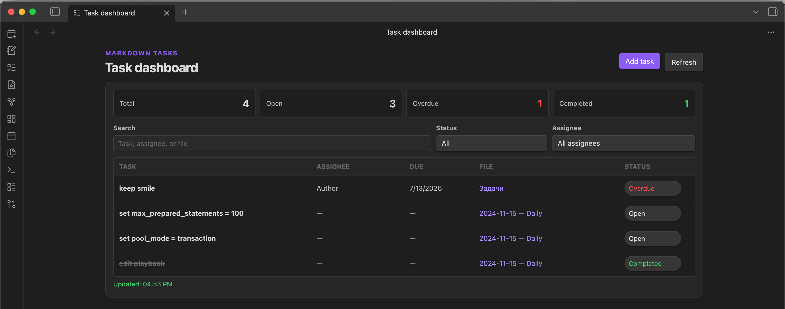

# Meeting Tools

<p align="center">
  
</p>

[Русская версия](README.ru.md)

Meeting Tools is an Obsidian plugin for creating fast, consistent Minutes of Meeting (MoM) without leaving your notes. It provides template-driven meeting forms, a lightweight meeting journal, and a task dashboard.

## Why Meeting Tools?

The plugin was created to reduce the effort required to write a useful MoM. Instead of creating a file, choosing a folder, copying headings, formatting tasks, and renaming the note manually, you fill in one compact form and Meeting Tools creates the Markdown note in the configured location.

For a meeting that only needs a date and a short outcome, use **Quick meeting**. For a structured MoM with participants, decisions, tasks, and custom sections, use **New meeting**.

<p align="center">
  
</p>

## Features

- Create structured meeting notes from Markdown templates.
- Fall back to a built-in template when no external templates exist.
- Organize notes by year/month, year only, or without subfolders.
- Add tasks through a dynamic form with title, assignee, and due date.
- Append lightweight “date + outcome” entries to meeting journals.
- Review and update tasks in a searchable dashboard.
- Add standalone tasks directly from the dashboard.
- Configure template, meeting, journal, and task folders independently.
- Use the interface in English or Russian, automatically matched to Obsidian or selected manually.
- Work locally through the Obsidian Vault API, without a server, container, account, or network connection.

## What is an Obsidian vault?

An Obsidian **vault** is the regular folder on your computer that you open in Obsidian. It contains your Markdown (`.md`) notes, attachments, and the hidden `.obsidian` configuration folder.

For example:

```text
Work notes/                         ← vault folder
├── .obsidian/                      ← Obsidian settings and plugins
├── Templates/                      ← optional Meeting Tools templates
├── Meetings/                       ← notes created by Meeting Tools
└── Projects/
```

When this README says “copy a file to your vault”, it means copying it somewhere inside that folder.

## Installation

### Community plugins

After Meeting Tools is accepted into the official directory:

1. Open **Settings → Community plugins** in Obsidian.
2. Select **Browse** and search for **Meeting Tools**.
3. Select **Install**, then **Enable**.

### Manual installation

1. Download `main.js`, `manifest.json`, and `styles.css` from the matching GitHub release.
2. Inside your vault, create:

   ```text
   .obsidian/plugins/meeting-tools/
   ```

3. Put the three files directly in that folder.
4. Restart Obsidian.
5. Enable **Meeting Tools** under **Settings → Community plugins**.

Do not copy `data.json` between vaults. It contains settings for one specific vault.

## Quick start

After enabling the plugin, three ribbon icons appear in the left sidebar:

- **New meeting** creates a full MoM.
- **Quick meeting** appends a date and outcome to a journal.
- **Task dashboard** shows tasks found in the configured folder.

Open **Settings → Community plugins → Meeting Tools** to choose your folders and file structure.

Leaving the full meeting note folder or quick journal folder empty means the vault root. For example, an empty meeting folder with the year-only structure creates `2026/<meeting>.md`; an empty journal folder creates `2026.md` directly in the vault root.

## Templates

Meeting Tools reads Markdown files located directly in the configured template folder. Copy any files you want from [`examples/templates/en`](examples/templates/en) or [`examples/templates/ru`](examples/templates/ru) into a folder inside your vault, then select that folder in the plugin settings.

Example:

```text
My vault/
└── Templates/
    ├── Meeting.md
    ├── Daily stand-up.md
    └── Weekly review.md
```

Template YAML defines metadata. Markdown headings become form fields, and the HTML comment below a heading becomes its placeholder:

```markdown
---
tags:
  - area/work
  - type/meeting
project: "Team"
series: "Weekly review"
cadence: weekly
---

# Weekly review

> [!summary] Weekly outcome
> <!-- Key result and current risk. -->

## Decisions

<!-- Record the decisions made. -->

## Tasks

<!-- This section becomes a dynamic task form. -->

## Notes

<!-- Additional context. -->
```

`## Tasks` and `## Задачи` are recognized as dynamic task sections. `Meeting.md` and `Встреча.md` are treated as generic meeting types, so the form also asks for a meeting name.

User templates are not translated automatically. Their headings and placeholders remain in the language in which they were written. The built-in template follows the selected interface language and remains available for manual selection even when external templates exist.

## Meeting journals

Quick meeting stores only the date and the entered outcome. A one-line entry looks like:

<p align="center">
  
</p>

```markdown
2026-07-14 — Architecture reviewed and next step agreed
```

Available journal structures:

- year/month: `<folder>/2026/07.md`;
- year only: `<folder>/2026.md`;
- no subfolders: `<folder>/Meetings.md`.

## Task dashboard

<p align="center">
  
</p>

Tasks created by the meeting form are normal Markdown checkbox lines:

```markdown
- [ ] Prepare the rollout plan — @Alex #assignee/alex 📅 2026-07-20
- [x] Review the architecture — @Sam #assignee/sam ✅ 2026-07-14
```

The dashboard shows task, assignee, due date, source file, and status. It includes search, status and assignee filters, overdue statistics, and direct status updates. Before changing a task, the plugin checks that the original source line has not changed.

The dashboard can also be used independently as a local task tracker. Point the task search folder to any folder in your vault that contains supported Markdown checkbox lines; those files do not have to be meeting notes or be created by Meeting Tools.

Use **Add task** in the dashboard to create a task with a title, assignee, and due date. The destination Markdown file is configured separately under **Settings → Meeting Tools → Task dashboard** and must be located inside the dashboard search folder.

## Privacy and data access

Meeting Tools:

- does not use telemetry or analytics;
- does not require an account or payment;
- does not make network requests;
- does not access files outside the current vault;
- reads templates and task notes from folders selected in settings;
- writes only when you create a meeting, append a journal entry, or explicitly change a task status.

## Development and releases

Source files are in [`src`](src). Development requires Node.js 18+ and pnpm. Install the dependencies once:

```bash
pnpm install
```

Create a minified production bundle:

```bash
pnpm build
```

For development with automatic rebuilds and inline source maps, use `pnpm dev`.

The production command creates a minified `main.js`. For an Obsidian release, attach `main.js`, `manifest.json`, and `styles.css` to a GitHub release whose tag exactly matches the version in `manifest.json`.

## License

Meeting Tools is available under the [MIT License](LICENSE).
